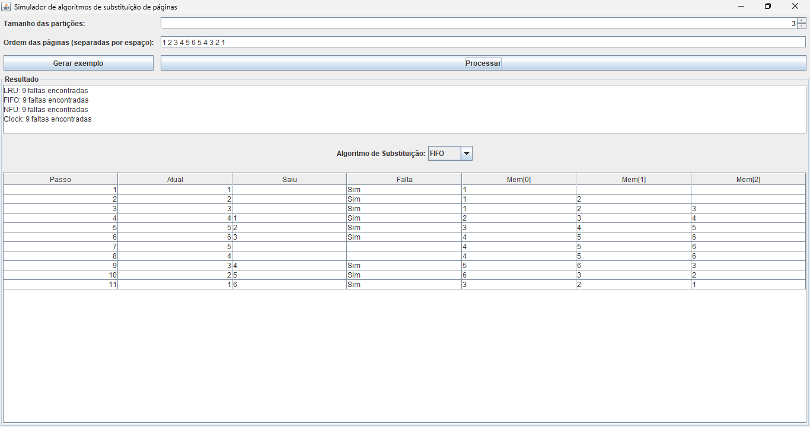

# Page Simulador 🚀

Simulador (GUI) de algoritmos de substituição de páginas em Java. O objetivo é comparar a quantidade de faltas de página em diferentes cenários de memória virtual. 💻

## Como utilizar



Ao informar os dados necessarios pressione o botão "**Processar**" e veja os resultados.

### Dados de entrada
- **Tamanho das partições**: Informa quantas partições a mémoria tem, ou seja a quantidade de páginas que podem ficar na mémoria aos mesmo tempo.
- **Ordem das páginas**: As páginas que vão passar pela mémoria separadas por espaço.

### Dados de saída
- Uma caixa de texto com a quantidade por método.
- Uma tabela de como estava o estado da mémoria passo a passo.

## Requisitos ✅
- ☕ Java 8+ (recomendado Java 11 ou superior)
- 🧰 Opcional: IntelliJ IDEA (ou outra IDE Java)

## Como executar ▶️

### Opção 1 — Pela IDE (IntelliJ IDEA) 🧠
1. 📂 Abra a pasta do projeto no IntelliJ IDEA.
2. 🗂️ Certifique-se de que a pasta `src` está marcada como Source Root (geralmente é automático).
3. ▶️ Abra `src/Main.java` e execute a classe `Main` (Run > Run 'Main').
4. 🪟 A interface Swing será aberta.

### Opção 2 — Pelo terminal 🖥️
Você pode compilar e executar usando `javac`/`java`. Abaixo exemplos.

- Estando na raiz do projeto (`PageSimulator`):
  - 🧱 Compilar:
    ```bash
    javac -d out src/core/*.java src/ui/*.java src/Main.java
    ```
  - ▶️ Executar:
    ```bash
    java -cp out Main
    ```

📦 Se preferir gerar um JAR simples:
```bash
jar --create --file PageSimulator.jar -C out .
java -cp PageSimulator.jar Main
```
(Em algumas instalações, use `jar cvf` em vez de `jar --create`.)

## Como usar (GUI) 🖱️
1. 🧮 Informe o tamanho das partições (número de molduras de página).
2. 📑 Digite a ordem de referência das páginas como números inteiros separados por espaço, por exemplo:
   - `1 2 3 4 1 2 5 1 2 3 4 5`
3. ▶️ Clique em "Processar" para calcular e exibir as faltas de página para LRU e FIFO.
4. 🎲 Você pode clicar em "Gerar exemplo" para preencher automaticamente um conjunto de teste.

## Algoritmos implementados 🧠
- FIFO (First-In, First-Out): a página mais antiga na memória é substituída quando ocorre falta de página. 📜
- LRU (Least Recently Used): substitui a página que foi menos recentemente usada. ⏱️

## Estrutura do projeto 🗂️
```
PageSimulator/
├─ src/
│  ├─ core/            # algoritmos
│  │  ├─ FIFO.java
│  │  └─ LRU.java
│  ├─ ui/              # interface gráfica
│  │  └─ MainFrame.java
│  └─ Main.java
└─ out/               # diretório de build usado nos exemplos de compilação 🏗️
```

## Licença 📄
Projeto acadêmico/educacional. Use e adapte livremente conforme necessário.
